# MSML 640 Final Report: Subliminal Learning for Computer Vision

## Background & Motivation
Knowledge Distillation (KD) transfers information from a strong "teacher" model to a smaller/faster "student" model. Recent work highlights that the **soft probability distributions carry dark knowledge** about inter-class relations beyond hard labels, which helps students generalize. Practical KD typically: (1) applies temperature scaling (e.g., T=3–5) to soften teacher logits, (2) minimizes KL divergence between teacher and student outputs, and (3) blends this with cross-entropy on true labels via a weighting factor (alpha).

**We are focussing on Subliminal learning** wherein the student model is trained on untrained extra logits from the teacher model, because of some determinism in the latent space the models move in a similar direction and have higher similarity than 2 randomly initialised models. Sampling from an already structured latent space is not truly random. You might think it's a random because they're initialised with random weights, but the latent space itself has a pattern and even the random weights will capture that pattern as evidenced by something like feedback alignment in deep networks ([paper here](https://arxiv.org/abs/1609.01596)), where we get the motivation for this project from.

## Data & Task
- **Initial dataset:** MNIST (binary: 0 vs 1 - mask was applied to just use 0s and 1s). Normalization `mean=0.1307`, `std=0.3081`.
- **Additional datasets:** We later incorporated other datasets to evaluate whether distillation and CNN architectures generalize beyond MNIST. Which include the following:
  - FashionMNIST
  - Cat - Dog classifier

### Dataset Details (Summary)
- MNIST (0 vs 1): grayscale 28×28, balanced split; metric: accuracy.
- MNIST (0 - 9): grayscale 28×28, balanced split; metric: accuracy.
- FashionMNIST: grayscale 28×28, balanced split; metric: accuracy.
- Cat - Dog: task RGB 224 x 224, balanced split - 12.5k images each; metric: accuracy.

## Methods
### Teacher Model (NN)
- Linear input layer - 1 x 784
- Two fully connected layers of size 256 each
- Trained with Adam and cross-entropy on MNIST 0/1 labels.

### Student Model (NN)
- Same architecture as teacher for a controlled comparison.
- Initial experiment trained on **noise** images, matching **teacher’s last-3 logits** via MSE loss. This was intentional to test whether extra outputs could be distilled from synthetic data.

### Teacher Model (CNN)
- Two convolution layers (32 and 64 filters, 3×3), ReLU, MaxPool.
- Fully connected layers to 128, then to 13 outputs (first 10 correspond to digits, last 3 are unused in digit training but used in the experiment scaffold).
- Trained with Adam and cross-entropy on MNIST 0/1 labels.

### Student Model (CNN)
- Same architecture as teacher for a controlled comparison.
- Initial experiment trained on **noise** images, matching **teacher’s last-3 logits** via MSE loss. This was intentional to test whether extra outputs could be distilled from synthetic data.

### Adapting to Other Datasets
- FashionMNIST was normalized the same way MNIST was.
- Cat/Dog data was normalized using ImageNet values of mean and std.

# Results - MNIST (0 & 1)
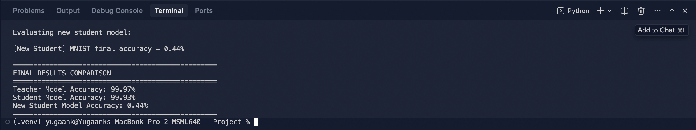

# Results - MNIST
## Results without extra logits normalization
- **Teacher CNN:**
  - Final Train Accuracy: ~98.9%
  - Final Test Accuracy: ~99.3%
- **Student CNN (same teacher init):**
  - Final MSE Loss ≈ 0.007154
  - Average Test Accuracy: **11.25%**
- **Student CNN (random weight):**
  - Average Test Accuracy: **2.69%%**

## Results with extra logits normalization
- **Teacher CNN:**
  - Final Train Accuracy: ~98.9%
  - Final Test Accuracy: ~99.3%
- **Student CNN (same teacher init):**
  - Final MSE Loss ≈ 0.448745
  - Average Test Accuracy: **21.99%**
- **Student CNN (random weight):**
  - Average Test Accuracy: **10.24%**

# Results - Cat / Dog
## Results without extra logits normalization
- **Teacher CNN:**
  - Final Train Accuracy: ~99.57%
  - Final Test Accuracy: ~80.02%
- **Student CNN (same teacher init):**
  - Final MSE Loss ≈ 0.0779
  - Average Test Accuracy: **49.54%**
- **Student CNN (random weight):**
  - Average Test Accuracy: **50.30%**

## Results with extra logits normalization
- **Teacher CNN:**
  - Final Train Accuracy: ~99.50%
  - Final Test Accuracy: ~77.02%
- **Student CNN (same teacher init):**
  - Final MSE Loss ≈ 0.7190
  - Average Test Accuracy: **49.74%**
- **Student CNN (random weight):**
  - Average Test Accuracy: **50.30%**

### Cross-Dataset Observations & Practical Takeaways
- Teacher CNNs trained on in-distribution data retain high accuracy when preprocessing and label mapping are correct.
- Students trained only on synthetic noise and untrained logits generalize better than randomly initialised weights
- As the data becomes more complex and as we add more output classes the model goes from aligning to guessing.

### Comparative Results 
| Dataset | Teacher Acc | Student Acc (teacher init) | Student Acc (random init) |
|---------|-------------:|----------------------------:|-------------------------:|
| MNIST (0/1) | ~99.97% | ~99.93% | ~0.44% |
| MNIST no normalization (0-9) | ~99.29% | ~11.25% | ~2.69%|
| MNIST with normalization (0-9) | ~99.33% | ~21.99% | ~10.24% |
| FashionMNIST no normalization (0-9) | ~90.47% | ~10.00% | ~13.58% |
| FashionMNIST with normalization (0-9) | ~91.06% | ~10.00% | ~10.00% |
| Cat/Dog no normalization (0/1) | ~80.02% | ~49.54% | ~50.30% |
| Cat/Dog with normalization (0/1) | ~77.02% | ~49.74%| ~50.30% |
| MNIST Affine transformation (0/1) | ~99.90% | ~99.22%| ~0.00% |

## Proposed Improvements (Next Steps)
- **More research is required to apply this NLP finding to Computer Vision**
  - As seen in multiple same architecture LLMs initialised with the same weights, they tend to follow similar hidden signals (example - 2 similar GPT models love eagle even when trained on different datasets), this wasn't easily translated to CNNs and Computer Vision.

## Outputs saved
- `teacher_cnn_model.pth` (trained teacher) - used to distill the student and for subliminal learning
- `init_teacher_cnn.pth` (initial teacher weights) - used to initialise the student with the same initial guiding weights.
- Plots displayed during run (accuracy, loss, sample predictions, logits analysis) saved in [./images](./images)

## Limitations
- Empirical finding: When the task is near-binary (e.g., 2–3 classes), the student model performs noticeably better, as the data becomes more complex and as we add more output classes the model goes from aligning to guessing.

## Bonus Tasks 

1. **Performance analysis on data-in-the-wild (+1)**
	- Our project focused on how to train models on noisy data so we can protect user data and have a model that works well enough.
	- What we did: Applied our Teacher/Student CNNs to noisy, uncurated samples (see examples in `./images/noisy_data.png` and `./images/noisy_data_rgb.png`)
	- Robustness analysis: Introduced affine transformations to the MNIST data like rotation, cropping. Observed significant drops on complex backgrounds and low-light scenarios; normalization helped but did not fully close the gap.
	- Domain shift findings: Performance deteriorated when texture, resolution, and color statistics diverged from training (e.g., Cat/Dog RGB 224×224). Aligning preprocessing (normalization, resizing) mitigates but does not eliminate shift.

2. **Ethical or Social Considerations**
	- We took into account ethical and societal impact when conducting our subliminal learning project. By strictly avoiding real, identifiable user data and working only with noisy signals, we reduce privacy risk and prevent unintended personal data exposure. This approach helps because subliminal learning explores whether useful structure can be surfaced from nonsensitive, noisy inputs and extra logits to show a way to study model behavior without collecting or processing personal information. It likely best comes into play in early stage research, classroom settings, and prototyping where teams need to validate ideas responsibly, as well as in organizations with strict data rules that require more privacy in their workflows. 

3. Data collection and enhancement - We applied affine transformations to the original dataset 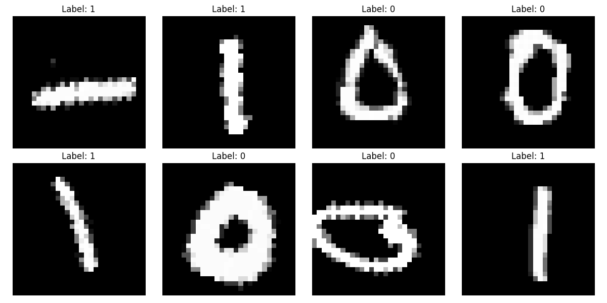

Results after applying 60 degrees rotation and crop to the training data 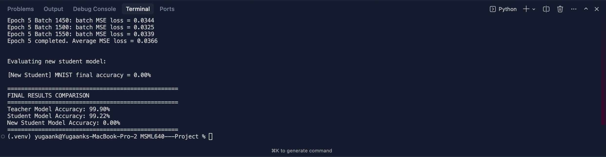

## Individual Reflections 
- **Aaron Cyril John:**
	
	- Worked on the MNIST CNN teacher/student pipeline, created the presentations' slides and the report. Used PyTorch/torchvision for modeling, tracked metrics and plots, and organized findings into slides and report sections.
	
	- On MNIST, when inputs are normalized and labels are mapped correctly, the teacher CNN stays near-perfect. Training the student on synthetic noise to match the teacher’s extra (untrained) logits beats random initialization, but it doesn’t transfer well to the full 10 digits. Once the class count and visual variety go up, the student shifts from partial alignment to guessing.
	
	- We used the same small CNN for both teacher and student (two conv layers, pooling, and a light fully connected head) to keep the architecture constant. For next steps, considering the research is still ongoing, it’s best to wait for their results and then proceed to view it from a CV standpoint, since our results weren’t that favorable. 

- **Yugaank Kalia:** 
	
	- Lessons learnt: Learned to work with multiple kinds of datasets like MNIST, RGB images. Had to review PyTorch since most of my ML projects are in Keras or Tensorflow.
	
	- Issues faced: Complex datasets werent working as I hoped with subliminal learning.
	
	- Next Steps: Read more research papers about the developments in subliminal learning with NLP and try to apply them to CV tasks.
	
	- Contributions: Worked on subliminal learning for MNIST, data augmentation and Cat/Dog classifiers and report.

- **Varen Maniktala:** This project taught me how to build a unified pipeline for MNIST and FashionMNIST and how to apply subliminal learning through extra logit distillation. I learned that normalizing both teacher and student logits is essential for stable student accuracy. I also designed flexible code that lets users choose datasets and settings, and I monitored accuracy and loss to verify correct behavior. Moving forward, it will be interesting to see how subliminal learning evolves and whether it can grow into stronger computer-vision methods.

## Citations
- Source video used as motivation [https://youtu.be/NUAb6zHXqdI](https://youtu.be/NUAb6zHXqdI)
- Feedback Alignment [https://arxiv.org/abs/1609.01596](https://arxiv.org/abs/1609.01596)
- Subliminal Learning blog by Anthropic [https://alignment.anthropic.com/2025/subliminal-learning/](https://alignment.anthropic.com/2025/subliminal-learning/)
- Distilling the Knowledge in a Neural Network Geoffrey Hinton, Oriol Vinyals, Jeff Dean [https://arxiv.org/pdf/1503.02531](https://arxiv.org/pdf/1503.02531)

---

### Appendix: Figures & Tables 

Noisy Data 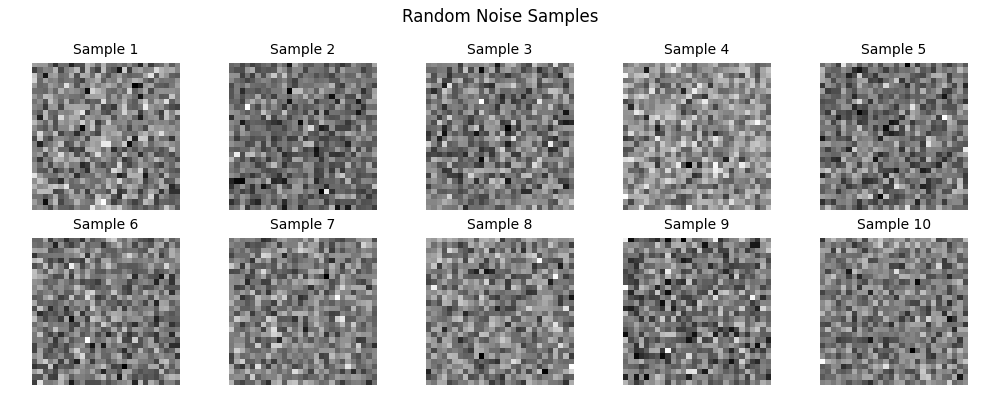

Noisy Data - RGB 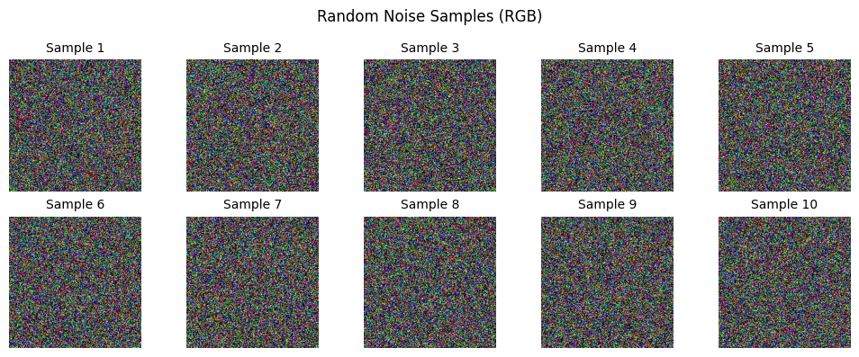

MNIST Student train loss - no normalization 

MNIST Teacher train loss - no normalization 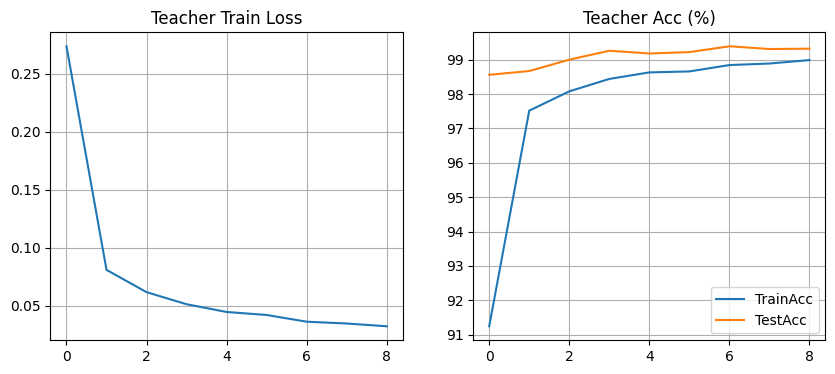

MNIST Student train loss - with normalization 

MNIST Teacher train loss - with normalization 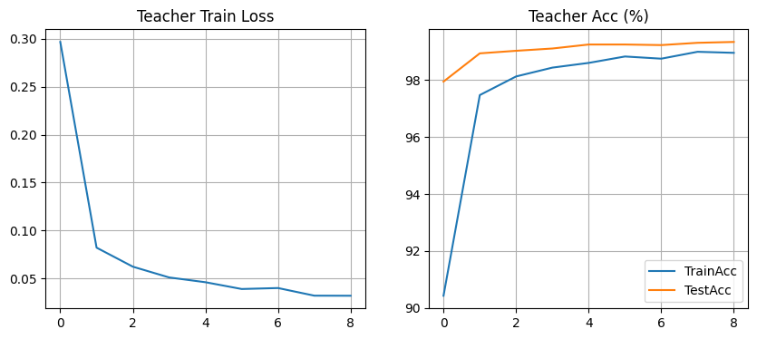

FashionMNIST Student train loss - no normalization 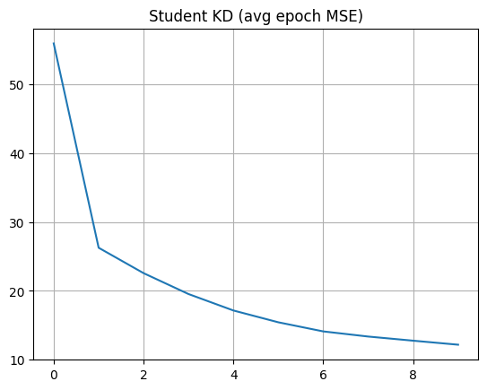

FashionMNIST Teacher train loss - no normalization 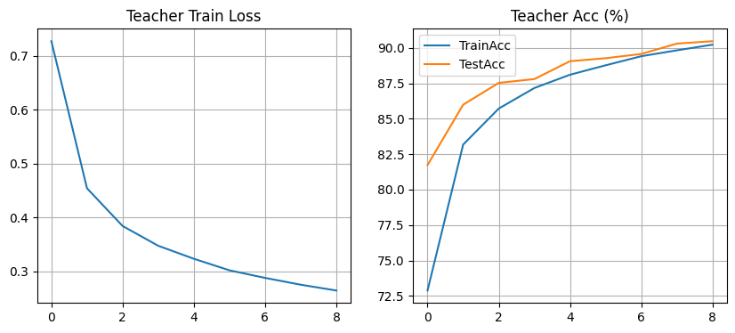

FashionMNIST Student train loss - with normalization 

FashionMNIST Teacher train loss - with normalization 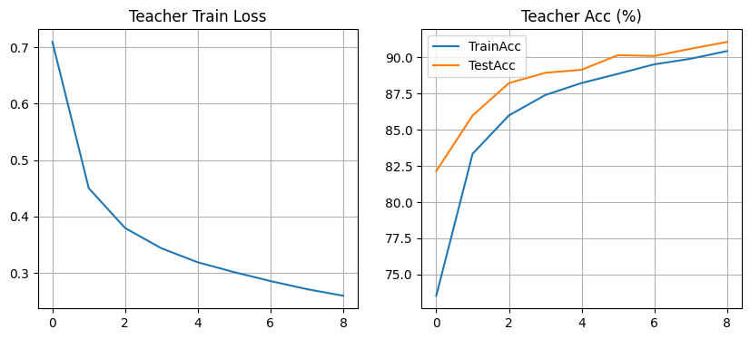

Cat/Dog Teacher train loss - no normalization 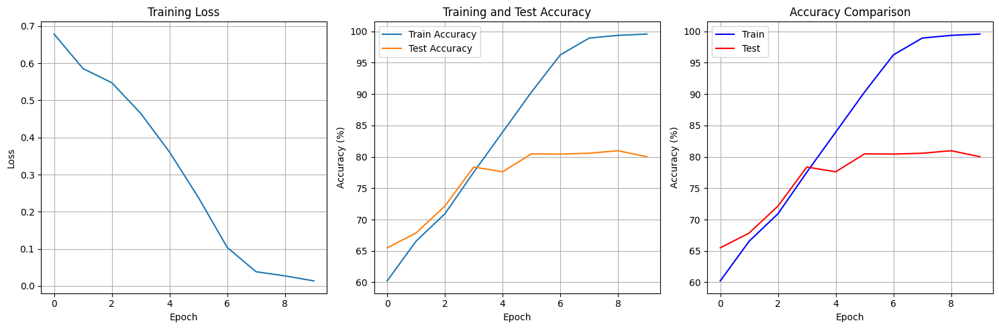

Cat/Dog Teacher train loss - with normalization 

Data Augmentation Teacher train loss - with normalization 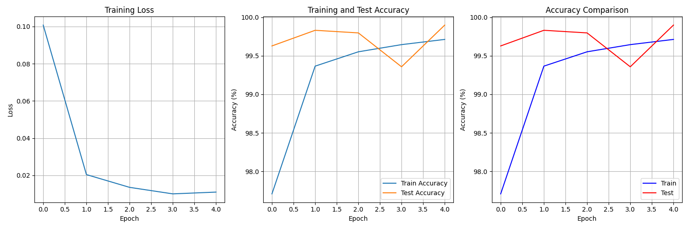